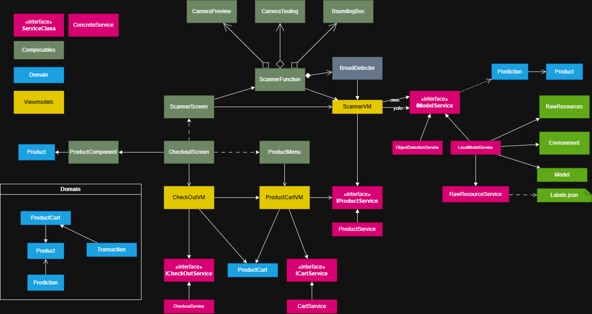

# Detailed Technical Design

This document provides a detailed overview of the system architecture, focusing on the class structure and the interaction between core components.

## Core Architecture
The application follows a **MVVM (Model-View-ViewModel)** architectural pattern, leveraging Jetpack Compose for the UI layer and official Android Architecture Components for state management.

### Key Components
- **UI Layer**: Composed of Jetpack Compose functions for `ScannerScreen` and `CheckoutScreen`.
- **ViewModel Layer**: Manages screen-specific state and bridges the gap between the UI and domain logic.
- **Service Layer**: Handles specialized tasks such as `ObjectDetectionService`, `ProductService`, and `PredictionService`.
- **Domain Models**: Contains entities like `Product`, `Checkout`, and `Prediction`.

---

## Class Diagram
The following diagram illustrates the high-level relationships between the main classes, services, and models.

### Diagram Breakdown
1.  **ScannerFeature**: Orchestrates the CameraX lifecycle and real-time object detection.
2.  **ModelServices**: Encapsulates the ONNX Runtime and ML Kit logic for product classification and localization.
3.  **Checkout Logic**: Manages the accumulation of scanned items and the final transaction state.

---
*Last updated: April 2026*